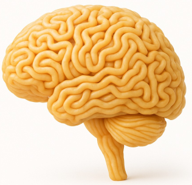

   

<h1 align="center">Noodle 🍜≈🧠
  

  
</h1>

**Noodle** is a lightweight convolutional neural network inference library designed for MCUs with **very small RAM**.  
It streams activations and weights from **SD/FFat/SD_MMC** filesystems to overcome RAM limitations, while providing modular primitives for **convolution, pooling, FCN, and activations**. During the development, we typically test Noodle with Arduino UNO R3, UNO R4, and some ESP32 variants.

---

## Documentation

https://auralius.github.io/noodle/

## Authors

- Auralius Manurung — Universitas Telkom, Bandung  
- Lisa Kristiana — ITENAS, Bandung

