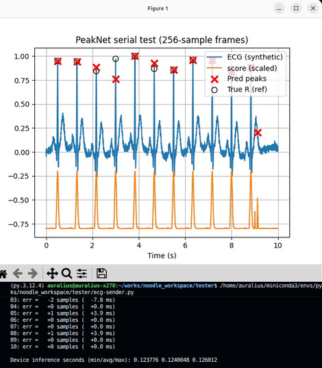

## Peak Detection with a 1D Convolutional Network (PeakNet1D)
### ESP32



In this experiment, we implement a simple but powerful peak detection system using a one-dimensional convolutional neural network (PeakNet1D). The goal is to detect peaks (such as R-peaks in ECG signals) directly from raw time-domain data, without hand-crafted feature extraction.

_Google Colab Notebook can be found [here](https://colab.research.google.com/drive/1PFdsJ4rrTK7F8FewhGauMTJWMXRP7i3E?usp=sharing)._

### 1. Input representation
Each input window contains **256 samples**, corresponding to a short segment of the signal (one second at 256 Hz). We can think of this as a vector:

$$x=[x_0,x_1,x_2,…,x_{255}] $$

$$\bar{x}=\frac{x-\text{mean}(x)}{\text{std}(x)}$$

where $x$  and $\bar{x}$ are the ECG signal and the normalized ECG signal, respectively.
At this stage:

- there is **only one channel**
- each sample represents signal amplitude at a specific time index
    
The network processes this window and produces **256 output values**, one for each time step. Each output value represents how likely that time index corresponds to a peak.

---

### 2. Output representation

Instead of producing a single classification result (“peak” or “not peak”), PeakNet1D produces a **score at every time index**. This is achieved by using only convolutional layers with stride = 1 and “same” padding.

$$y=[y_0,y_1,y_2,…,y_{255}] $$

For example, $y_0$ is the probability that $x_0$ is a signal peak.

### 3. Layer-by-layer intuition

The network is composed of six convolutional layers:
```
// PeakNet1D layers
ConvMem c1; c1.K=9; c1.P=4; c1.S=1; c1.weight=w01; c1.bias=b01; c1.act=ACT_RELU; // 1->8
ConvMem c2; c2.K=7; c2.P=3; c2.S=1; c2.weight=w02; c2.bias=b02; c2.act=ACT_RELU; // 8->16
ConvMem c3; c3.K=7; c3.P=3; c3.S=1; c3.weight=w03; c3.bias=b03; c3.act=ACT_RELU; // 16->16
ConvMem c4; c4.K=7; c4.P=3; c4.S=1; c4.weight=w04; c4.bias=b04; c4.act=ACT_RELU; // 16->16
ConvMem c5; c5.K=1; c5.P=0; c5.S=1; c5.weight=w05; c5.bias=b05; c5.act=ACT_RELU; // 16->16
ConvMem c6; c6.K=1; c6.P=0; c6.S=1; c6.weight=w06; c6.bias=b06; c6.act=ACT_NONE; // 16->1

uint16_t V = L;

// noodle_conv1d(in, n_inputs, out, n_outputs, W, conv)
V = noodle_conv1d(BUFFER3, 1,  BUFFER4, 8,  V, c1, NULL);
V = noodle_conv1d(BUFFER4, 8,  BUFFER3, 16, V, c2, NULL);
V = noodle_conv1d(BUFFER3, 16, BUFFER4, 16, V, c3, NULL);
V = noodle_conv1d(BUFFER4, 16, BUFFER3, 16, V, c4, NULL);
V = noodle_conv1d(BUFFER3, 16, BUFFER4, 16, V, c5, NULL);
V = noodle_conv1d(BUFFER4, 16, BUFFER3, 1,  V, c6, NULL);

// Final sigmoid on 1 channel output
noodle_sigmoid(BUFFER3, V);
```

The layers use larger kernels (7–9 samples wide). The number of channels increases (1 → 8 → 16), allowing the network to represent multiple feature types simultaneously. The last layer reduces the channel dimension from 16 to 1. After the final convolution, a sigmoid function maps each value into $[0,1]$, producing a **peak likelihood signal**.

In the implementation, two large buffers are used (`BUFFER3` and `BUFFER4`) with alternating roles (input and output). This is known as **ping-pong buffering**.

| Stage    | Active buffer | Channels × length | Floats |
| -------- | ------------- | ----------------- | ------ |
| Input    | `BUFFER3`     | 1 × 256           | 256    |
| After c1 | `BUFFER4`     | 8 × 256           | 2048   |
| After c2 | `BUFFER3`     | 16 × 256          | 4096   |
| After c3 | `BUFFER4`     | 16 × 256          | 4096   |
| After c4 | `BUFFER3`     | 16 × 256          | 4096   |
| After c5 | `BUFFER4`     | 16 × 256          | 4096   |
| After c6 | `BUFFER3`     | 1 × 256           | 256    |

### 4. From scores to peaks

The output of the network is **not yet a list of peaks**. Instead, it is a smooth score curve, ranging from 0 to 1:

$$y[t]∈[0,1],\,t=0,1,…255 $$

Peak detection is completed using simple thresholding (post-processing step):

$$\text{peak}(t)=1 \, \text{if} \, y[t]>0.5 $$

There is also additional logic to perform refractory period enforcement (to avoid double counting).

---
### Uno R4

The implementation above fits flawlessly in general ESP32 (320KB of RAM). However, in Uno R4 with 32KB of RAM, that implementation will not work. The main challenges are dealing with in the input, output and intermediate activation variables that actually contribute to the memory peaks.


As expected, the inference time takes longer, which is ~26 seconds. For flexible manipulation, Noodle offers the following configuration for some layer operations.
- File → Variable layer operation requires input scratch
* Variable → File layer operation requires output scratch 
* File → File layer operation requires input and output scratch 

For $C \times W \times W$ tensor,  the size of the scratch buffer is $W \times W$. This, we can safely use input and output variables as scratch buffer. 

|  |
| ---------------------------- |

