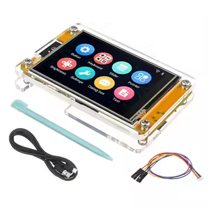
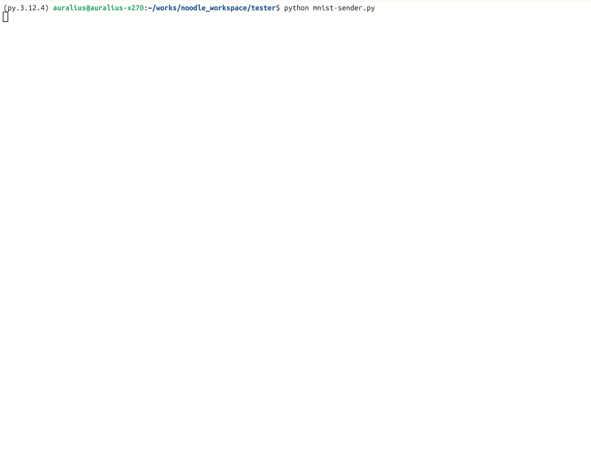

# LeNet-5 on ESP32
## Preface

- **Author:**  
	- Auralius Manurung (auralius.manurung@ieee.org)  
- **Repositories:** 
	- [GitHub (Visual Code and PlatformIO)](https://github.com/auralius/noodle/tree/main/examples/lenet-5-esp32).
	- [Google Colab notebook](https://drive.google.com/file/d/1BNx9QchbauAPEexnm5qL2H58Ve4BHAZP/view?usp=sharing)    
	- [Dataset link](https://drive.google.com/file/d/1rvQixKpxU0dBhDQ8B9gZxADqttoxJPK5/view?usp=drive_link)
- **Video demonstration :**


## Plan
We aim to implement a **slightly modified LeNet-5 network** that runs entirely on-device on an ESP32. To reflect a realistic inference scenario, user input will be captured via a **touchscreen interface**. This means the project involves not only the neural network itself, but also a **preprocessing pipeline** that converts raw touch input into a digitized 28×28 representation suitable for inference.

In short, the system consists of:

- on-device CNN inference
- touchscreen-based data acquisition
- preprocessing and normalization tailored to embedded constraints

In this documentation, we skip the preprocessing pipeline and focus on the neural network implementation using the **NOODLE** framework.

Implementation steps:

1. Design the network and train it (e.g., in Google Colab).
2. Export weights and biases.
3. Decide where each parameter lives:
    - **File storage**: SD card (SPI/SDIO), or flash filesystem (FFat/LittleFS)
    - **In-memory storage**: `const` in flash, or SRAM/PSRAM
4. Implement the network layer-by-layer using NOODLE
---
## Cheap Yellow Display (CYD)
The CYD is an ESP32-based development board with an integrated LCD display and touchscreen. The display measures **2.8 inches** with a **320×240 pixel resolution**. Due to its low cost and decent performance, the CYD has gained popularity in the ESP32 community, with several public repositories and example projects available, such as [ESP32-Cheap-Yellow-Display](https://github.com/witnessmenow/ESP32-Cheap-Yellow-Display).



The CYD uses SPI for both the display and the touch controller. These are typically wired with separate chip-select lines (and on some CYD variants, separate SPI buses), which helps when tracking continuous touch input for handwriting.

As an alternative, we can also use displays where the TFT uses a parallel bus (or SPI) while the touch uses analog inputs, such as [MCUFRIEND_kbv UNO shields](https://github.com/prenticedavid/MCUFRIEND_kbv).

-----
## Original architecture (1998)

The following figure and table describe the original LeNet-5 architecture.


|Layer|Type|Kernel / Stride|Input shape|Output shape|Notes|
|---|---|---|---|---|---|
|C1|Convolution|6×5×5|1×32×32|6×28×28|tanh|
|S2|Subsampling|2×2 / 2|6×28×28|6×14×14|average pooling (+ learnable scale/bias in classic LeNet)|
|C3|Convolution|16×5×5|6×14×14|16×10×10|tanh, sparse connection map|
|S4|Subsampling|2×2 / 2|16×10×10|16×5×5|average pooling|
|C5|Convolution|120×5×5|16×5×5|120×1×1|effectively fully connected|
|F6|Fully connected|—|120|84|tanh|
|Output|Fully connected|—|84|10|Euclidean RBF|

---
## Slightly modified architecture

Because the **C5 (120×5×5)** layer is equivalent to a dense layer from **400 → 120**, we implement it as flatten + FC:

|Layer|Type|Kernel / Stride|Input shape|Output shape|Notes|
|---|---|---|---|---|---|
|C1|Convolution|6×5×5|1×32×32|6×28×28|ReLU|
|S2|Subsampling|2×2 / 2|6×28×28|6×14×14|average pooling|
|C3|Convolution|16×5×5|6×14×14|16×10×10|ReLU|
|S4|Subsampling|2×2 / 2|16×10×10|16×5×5|average pooling|
|F5|Flatten|—|16×5×5|400|16×5×5 = 400|
|F6|FC|—|400|120|ReLU|
|F7|FC|—|120|84|ReLU|
|Output|FC|—|84|10|Softmax|

---
## Training (Keras / PyTorch)

Noodle does not provide training capability. We will perform training on a computer, extract the training results and deploy them to the ESP32. In this section, we use Google Colab (Keras and Python) for training.

- [Dataset link](https://drive.google.com/file/d/1rvQixKpxU0dBhDQ8B9gZxADqttoxJPK5/view?usp=drive_link)
- [Google Colab notebook](https://drive.google.com/file/d/1BNx9QchbauAPEexnm5qL2H58Ve4BHAZP/view?usp=sharing)    

---
## Naming convention (`.txt`)

The provided Keras training program come with an automatic exporter function that will export weights and biases with the following naming convention.

---
### Convolution kernels (4D tensors)

**Filename format**  
`w<NN>.txt`

Where `<NN>` is a two-digit, zero-padded index identifying a **weight tensor** (layer index).

**Example**  
`w01.txt` — convolution weights for layer 1.

**File contents**  
Each file stores **all convolution kernels for a single layer**, serialized into a **1D sequence**.

---
### Dense weights (2D tensors)

**Filename format:**  
`w<NN>.txt`

Where:

- `<NN>` is a two-digit, zero-padded index identifying a **weight tensor**

**Example:**  
`w03.txt`

Dense weights are exported as a transposed, flattened array, one value per line.

---

### Bias vectors (1D tensors)

**Filename format:**  
`b<NN>.txt`

Where:

- `<NN>` is a two-digit, zero-padded index identifying a **bias vector**

**Example:** 
`b02.txt`

Each file contains flattened bias values, one value per line.

---
The exporter program will print the generated files. These are some examples for the LeNet-5. Besides generating `TXT` files, the exporter also generates the header files. Thus, we can use them as `const` arrays stored in flash (variable-level mnemonics).
```
/content/drive/MyDrive/NOODLE/datasets/mnist/lenet-5/w01.txt /content/drive/MyDrive/NOODLE/datasets/mnist/lenet-5/w01.h /content/drive/MyDrive/NOODLE/datasets/mnist/lenet-5/b01.txt /content/drive/MyDrive/NOODLE/datasets/mnist/lenet-5/b01.h /content/drive/MyDrive/NOODLE/datasets/mnist/lenet-5/w02.txt /content/drive/MyDrive/NOODLE/datasets/mnist/lenet-5/w02.h /content/drive/MyDrive/NOODLE/datasets/mnist/lenet-5/b02.txt /content/drive/MyDrive/NOODLE/datasets/mnist/lenet-5/b02.h /content/drive/MyDrive/NOODLE/datasets/mnist/lenet-5/w03.txt /content/drive/MyDrive/NOODLE/datasets/mnist/lenet-5/w03.h /content/drive/MyDrive/NOODLE/datasets/mnist/lenet-5/b03.txt /content/drive/MyDrive/NOODLE/datasets/mnist/lenet-5/b03.h /content/drive/MyDrive/NOODLE/datasets/mnist/lenet-5/w04.txt /content/drive/MyDrive/NOODLE/datasets/mnist/lenet-5/w04.h /content/drive/MyDrive/NOODLE/datasets/mnist/lenet-5/b04.txt /content/drive/MyDrive/NOODLE/datasets/mnist/lenet-5/b04.h /content/drive/MyDrive/NOODLE/datasets/mnist/lenet-5/w05.txt /content/drive/MyDrive/NOODLE/datasets/mnist/lenet-5/w05.h /content/drive/MyDrive/NOODLE/datasets/mnist/lenet-5/b05.txt /content/drive/MyDrive/NOODLE/datasets/mnist/lenet-5/b05.h
```

---
## On the ESP32 side

For fully connected layers, NOODLE provides two parameter structures: `FCNMem` and `FCNFile`.

```cpp
/** FCN parameters (filenames; no tokenization). */
struct FCNFile {
  const char *weight_fn = nullptr;
  const char *bias_fn   = nullptr;
  Activation act = ACT_RELU;
};

/** FCN parameters for in-memory weights/bias (row-major weights [n_outputs, n_inputs]). */
struct FCNMem {
  const float *weight = nullptr;
  const float *bias   = nullptr;
  Activation act = ACT_RELU;
};
```

If weights/biases are in memory, we use `FCNMem`. If they are stored as files, we use `FCNFile`.

---
### Parameter placement

| Layer  | Files                | Location        | In-memory (`const`) | File-based |
| ------ | -------------------- | --------------- | ------------------- | ---------- |
| C1     | `w01.txt`, `b01.txt` | FFat            |                     | ✔          |
| C3     | `w02.txt`, `b02.txt` | FFat            |                     | ✔          |
| F6     | `w03.txt`, `b03.txt` | flash (`const`) | ✔                   |            |
| F7     | `w04.txt`, `b04.txt` | flash (`const`) | ✔                   |            |
| Output | `w05.txt`, `b05.txt` | flash (`const`) | ✔                   |            |

---
### Layer-by-layer implementation 
Here, we define **access to CNN parameters** as files while **access to FCN parameters as variables**.
```cpp
Conv cnn1;
cnn1.K = 5;
cnn1.P = 2;
cnn1.S = 1; // same padding
cnn1.weight_fn = "/w01.txt";
cnn1.bias_fn   = "/b01.txt";

Conv cnn2;
cnn2.K = 5;
cnn2.P = 0;
cnn2.S = 1; // valid padding
cnn2.weight_fn = "/w02.txt";
cnn2.bias_fn   = "/b02.txt";

Pool pool;
pool.M = 2;
pool.T = 2;

FCNMem fcn1;
fcn1.weight = w03;
fcn1.bias   = b03;
fcn1.act    = ACT_RELU;

FCNMem fcn2;
fcn2.weight = w04;
fcn2.bias   = b04;
fcn2.act    = ACT_RELU;

FCNMem fcn3;
fcn3.weight = w05;
fcn3.bias   = b05;
fcn3.act    = ACT_SOFTMAX;

uint16_t V;

V = noodle_conv_float(BUFFER1, 1, 6,  BUFFER3, 28, cnn1, pool, nullptr);
V = noodle_conv_float(BUFFER3, 6, 16, BUFFER1, V,  cnn2, pool, nullptr);

V = noodle_flat(BUFFER1, BUFFER3, V, 16);

V = noodle_fcn(BUFFER3, V, 120, BUFFER1, fcn1, nullptr);
V = noodle_fcn(BUFFER1, V, 84,  BUFFER3, fcn2, nullptr);
V = noodle_fcn(BUFFER3, V, 10,  BUFFER1, fcn3, nullptr);
```

This implementation requires three buffers:

- `BUFFER1`: input buffer
- `BUFFER2`: temporary/scratch buffer (set via `noodle_setup_temp_buffers()`)
- `BUFFER3`: output buffer
    
For the modified LeNet-5 implementation:
```less
Input image      :    BUFFER1
Conv + Pool #1   :    BUFFER1 → BUFFER3
Conv + Pool #2   :    BUFFER3 → BUFFER1
Flatten          :    BUFFER1 → BUFFER3
Dense #1         :    BUFFER3 → BUFFER1
Dense #2         :    BUFFER1 → BUFFER3
Dense #3         :    BUFFER3 → BUFFER1
```
---
## Visual Code with PlatformIO
We use Visual Studio Code with PlatformIO instead of the Arduino IDE primarily because it provides better support for file-system images on ESP32 devices (when compared to Arduino IDE). All files intended for the ESP32 filesystem are placed in the project’s `data/` directory.


The workflows are as follows.

- Build a file-system image from the contents of `data/` (all files in `data` directory to one image file:  `fatfs.bin`).
- Upload image file to the file-system partition in flash.
- Leave the application firmware unchanged

---
## Benchmarking 
To automate benchmarking, we deploy the classification model to an ESP32 and utilize a Python-based test harness. The harness applies random rotations within a range of $\pm20^{\circ}$ before streaming the payloads to the ESP32 via serial communication for inference. These random rotations were not applied during training.
### CNN as variables -- FCN as variables
To put the CNN parameters in SRAM, we use `ConvMem` structure.
```cpp
void predict(){
  ConvMem cnn1;
  cnn1.K = 5;
  cnn1.P = 2;
  cnn1.S = 1; // same padding
  cnn1.weight = w01;
  cnn1.bias   = b01;

  ConvMem cnn2;
  cnn2.K = 5;
  cnn2.P = 0;
  cnn2.S = 1; // valid padding
  cnn2.weight = w02;
  cnn2.bias   = b02;

  Pool pool;
  pool.M = 2;
  pool.T = 2;

  FCNMem fcn_mem1;
  fcn_mem1.weight = w03;
  fcn_mem1.bias   = b03;
  fcn_mem1.act    = ACT_RELU;

  FCNMem fcn_mem2;
  fcn_mem2.weight = w04;
  fcn_mem2.bias   = b04;
  fcn_mem2.act    = ACT_RELU;

  FCNMem fcn_mem3;
  fcn_mem3.weight = w05;
  fcn_mem3.bias   = b05;
  fcn_mem3.act    = ACT_SOFTMAX;

  unsigned long st = micros();
  uint16_t V;

  V = noodle_conv_float(BUFFER1, 1, 6, BUFFER3, 28, cnn1, pool, NULL);
  V = noodle_conv_float(BUFFER3, 6, 16, BUFFER1, V, cnn2, pool, NULL);

  V = noodle_flat(BUFFER1, BUFFER3, V, 16);

  V = noodle_fcn(BUFFER3, V, 120, BUFFER1, fcn_mem1, NULL);
  V = noodle_fcn(BUFFER1, V, 84,  BUFFER3, fcn_mem2, NULL);
  V = noodle_fcn(BUFFER3, V, 10,  BUFFER1, fcn_mem3, NULL);
  ⋮
  ⋮
}
```



---
### CNN as files -- FCN as variables
To put the CNN parameters in File, we use `Conv` structure.
```cpp
void predict()
{
  Conv cnn1;
  cnn1.K = 5;
  cnn1.P = 2;
  cnn1.S = 1; // same padding
  cnn1.weight_fn = "/w01.txt";
  cnn1.bias_fn   = "/b01.txt";

  Conv cnn2;
  cnn2.K = 5;
  cnn2.P = 0;
  cnn2.S = 1; // valid padding
  cnn2.weight_fn = "/w02.txt";
  cnn2.bias_fn   = "/b02.txt";

  Pool pool;
  pool.M = 2;
  pool.T = 2;

  FCNMem fcn_mem1;
  fcn_mem1.weight = w03;
  fcn_mem1.bias   = b03;
  fcn_mem1.act    = ACT_RELU;

  FCNMem fcn_mem2;
  fcn_mem2.weight = w04;
  fcn_mem2.bias   = b04;
  fcn_mem2.act    = ACT_RELU;

  FCNMem fcn_mem3;
  fcn_mem3.weight = w05;
  fcn_mem3.bias   = b05;
  fcn_mem3.act    = ACT_SOFTMAX;

  unsigned long st = micros();
  uint16_t V;

  V = noodle_conv_float(BUFFER1, 1, 6, BUFFER3, 28, cnn1, pool, NULL);
  V = noodle_conv_float(BUFFER3, 6, 16, BUFFER1, V, cnn2, pool, NULL);

  V = noodle_flat(BUFFER1, BUFFER3, V, 16);

  V = noodle_fcn(BUFFER3, V, 120, BUFFER1, fcn_mem1, NULL);
  V = noodle_fcn(BUFFER1, V, 84,  BUFFER3, fcn_mem2, NULL);
  V = noodle_fcn(BUFFER3, V, 10,  BUFFER1, fcn_mem3, NULL);
  ⋮
  ⋮
```

