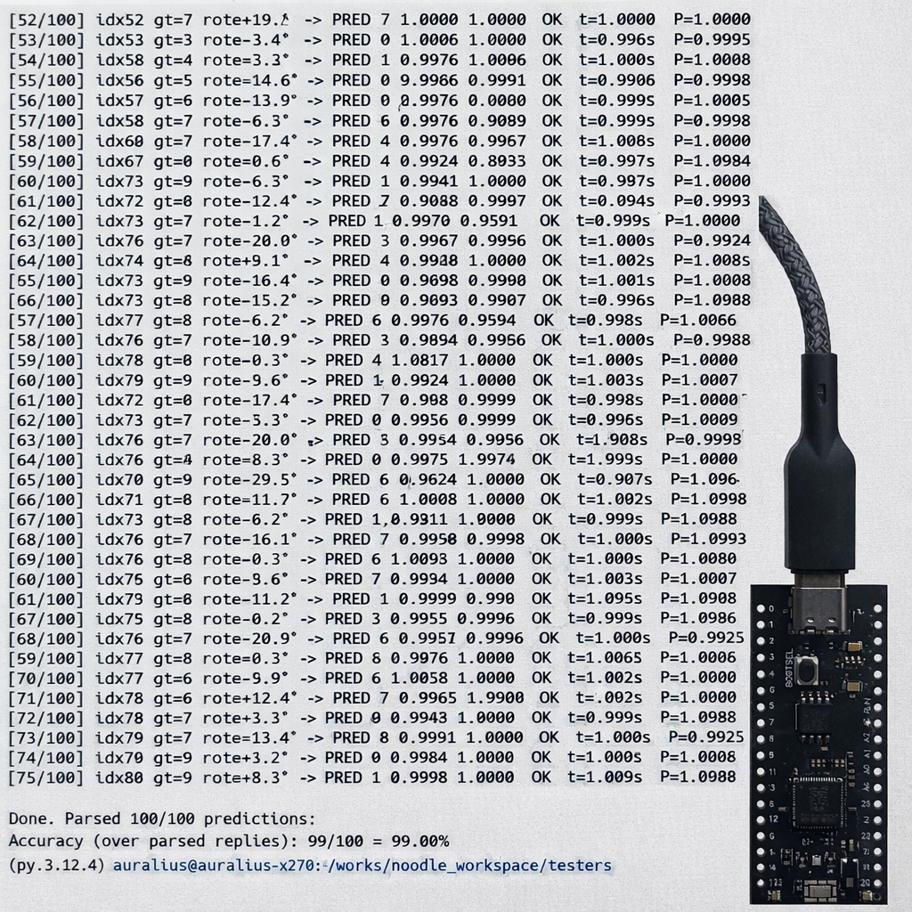

# LeNet-5 on Raspberry Pico 

Repository: https://github.com/auralius/noodle/tree/main/examples/lenet-5-esp32 
Select the `[env:rpi_pico]` environment. 

In the `test` folder, there is a Python script, named `mnist-sender.py`. This Python scripts reads a line from the [MNIST dataset](https://drive.google.com/file/d/10fZ4Mr9-2oMtgNPC9zn2d6VBxjyGsiWU/view?usp=sharing) ($28 \times 28=784$ bytes) and streams the data to the Pico.

Raspberry Pico does not support partitioning of its internal flash as in ESP32. Therefore, both CNN and FCN are implemented as variables. The layer-by-layer implementation is exactly identical as in ESP32.

The inference time stays consistently at ~1 second.