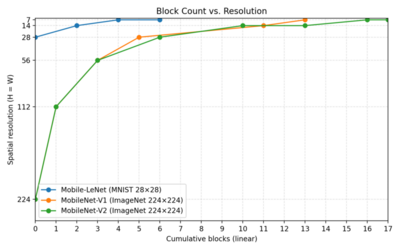

# Mobile-LeNet


- [_Google Colab notebook can be found here._](https://colab.research.google.com/drive/1WQ1yPFyfsqXl6NcWHlDjNY3L3Xgk8aC2?usp=sharing)
- [_Noodle Implementation can be found here._](https://github.com/auralius/noodle/tree/main/examples/mobile-lenet-5-esp32)

## Design Choices
**Mobile-LeNet** is a compact convolutional neural network inspired by both **LeNet-5** and **MobileNet-V1**. Its purpose is _didactic rather than competitive_: to expose, in a single small model, the full set of modern CNN building blocks commonly used in edge and embedded deep learning. Specifically, this model demonstrates:

- Standard convolution
- Depth-wise convolution    
- Point-wise (1×1) convolution
- Batch Normalization
- Non-linear activation (ReLU)
- Spatial downsampling via stride
- Global Average Pooling (GAP)
- Dense classification (or fully connected network / FCN)

The target dataset is **MNIST (28×28 grayscale)**




## Architectural Overview
| #   | Layer (Type)                                                                                                    | Output Shape | Params | Weight / Bias file   |
| --- | --------------------------------------------------------------------------------------------------------------- | ------------ | ------ | -------------------- |
| 1   | `stem_conv3x3` (Conv2D)                                                                                         | 28×28×8      | 80     | `w01.txt`, `b01.txt` |
| 2   | `stem_bn` (BatchNorm)                                                                                           | 28×28×8      | 32     | `bn01.txt`           |
| 3   | `stem_relu` (ReLU)                                                                                              | 28×28×8      | 0      | —                    |
| 4   | `B1_dw3x3_s1` (DepthwiseConv2D)                                                                                 | 28×28×8      | 72     | `w02.txt`            |
| 5   | `B1_dw_bn` (BatchNorm)                                                                                          | 28×28×8      | 32     | `bn02.txt`           |
| 6   | `B1_dw_relu` (ReLU)                                                                                             | 28×28×8      | 0      | —                    |
| 7   | `B1_pw1x1` (Conv2D)                                                                                             | 28×28×8      | 64     | `w03.txt`            |
| 8   | `B1_pw_bn` (BatchNorm)                                                                                          | 28×28×8      | 32     | `bn03.txt`           |
| 9   | `B1_pw_relu` (ReLU)                                                                                             | 28×28×8      | 0      | —                    |
| 10  | `B2_dw3x3_s1` (DepthwiseConv2D)                                                                                 | 28×28×8      | 72     | `w04.txt`            |
| 11  | `B2_dw_bn` (BatchNorm)                                                                                          | 28×28×8      | 32     | `bn04.txt`           |
| 12  | `B2_dw_relu` (ReLU)                                                                                             | 28×28×8      | 0      | —                    |
| 13  | `B2_pw1x1` (Conv2D)                                                                                             | 28×28×8      | 64     | `w05.txt`            |
| 14  | `B2_pw_bn` (BatchNorm)                                                                                          | 28×28×8      | 32     | `bn05.txt`           |
| 15  | `B2_pw_relu` (ReLU)                                                                                             | 28×28×8      | 0      | —                    |
| 16  | `B3_pad1` (ZeroPadding2D)                                                                                       | 30×30×8      | 0      | —                    |
| 17  | `B3_dw3x3_s2` (DepthwiseConv2D)                                                                                 | 14×14×8      | 72     | `w06.txt`            |
| 18  | `B3_dw_bn` (BatchNorm)                                                                                          | 14×14×8      | 32     | `bn06.txt`           |
| 19  | `B3_dw_relu` (ReLU)                                                                                             | 14×14×8      | 0      | —                    |
| 20  | `B3_pw1x1` (Conv2D)                                                                                             | 14×14×16     | 128    | `w07.txt`            |
| 21  | `B3_pw_bn` (BatchNorm)                                                                                          | 14×14×16     | 64     | `bn07.txt`           |
| 22  | `B3_pw_relu` (ReLU)                                                                                             | 14×14×16     | 0      | —                    |
| 23  | `B4_dw3x3_s1` (DepthwiseConv2D)                                                                                 | 14×14×16     | 144    | `w08.txt`            |
| 24  | `B4_dw_bn` (BatchNorm)                                                                                          | 14×14×16     | 64     | `bn08.txt`           |
| 25  | `B4_dw_relu` (ReLU)                                                                                             | 14×14×16     | 0      | —                    |
| 26  | `B4_pw1x1` (Conv2D)                                                                                             | 14×14×16     | 256    | `w09.txt`            |
| 27  | `B4_pw_bn` (BatchNorm)                                                                                          | 14×14×16     | 64     | `bn09.txt`           |
| 28  | `B4_pw_relu` (ReLU)                                                                                             | 14×14×16     | 0      | —                    |
| 29  | `B5_pad1` (ZeroPadding2D)                                                                                       | 16×16×16     | 0      | —                    |
| 30  | `B5_dw3x3_s2` (DepthwiseConv2D)                                                                                 | 7×7×16       | 144    | `w10.txt`            |
| 31  | `B5_dw_bn` (BatchNorm)                                                                                          | 7×7×16       | 64     | `bn10.txt`           |
| 32  | `B5_dw_relu` (ReLU)                                                                                             | 7×7×16       | 0      | —                    |
| 33  | `B5_pw1x1` (Conv2D)                                                                                             | 7×7×24       | 384    | `w11.txt`            |
| 34  | `B5_pw_bn` (BatchNorm)                                                                                          | 7×7×24       | 96     | `bn11.txt`           |
| 35  | `B5_pw_relu` (ReLU)                                                                                             | 7×7×24       | 0      | —                    |
| 36  | `B6_dw3x3_s1` (DepthwiseConv2D)                                                                                 | 7×7×24       | 216    | `w12.txt`            |
| 37  | `B6_dw_bn` (BatchNorm)                                                                                          | 7×7×24       | 96     | `bn12.txt`           |
| 38  | `B6_dw_relu` (ReLU)                                                                                             | 7×7×24       | 0      | —                    |
| 39  | `B6_pw1x1` (Conv2D)                                                                                             | 7×7×24       | 576    | `w13.txt`            |
| 40  | `B6_pw_bn` (BatchNorm)                                                                                          | 7×7×24       | 96     | `bn13.txt`           |
| 41  | `B6_pw_relu` (ReLU)                                                                                             | 7×7×24       | 0      | —                    |
| 42  | `GAP` (GlobalAveragePooling2D)                                                                                  | 24           | 0      | —                    |
| 43  | `OUT` (Dense)                                                                                                   | 10           | 250    | `w14.txt`, `b02.txt` |
|     | **Total parameters:** **3,258**<br>**Trainable parameters:** **2,890**<br>**Non-trainable parameters:** **368** |              |        |                      |

The network above follows a **progressive feature extraction** strategy:

1. **Early layers** preserve spatial resolution and learn low-level features (edges, strokes).
2. **Intermediate layers** downsample while increasing channel capacity.
3. **Late layers** aggregate global structure before classification.
    
Downsampling is performed using **stride-2 depth-wise convolution**, replacing the pooling layers used in classic LeNet.

## Stem Convolution

The stem consists of a single standard convolution:

- **K = 3×3, S = 1, P = 1**
- Expands the channel dimension from 1 → 8
- Preserves spatial resolution (28×28)

This layer converts raw pixel intensity into a small set of learned feature maps. Batch Normalization and ReLU immediately follow to stabilize optimization and introduce nonlinearity.

## Depth-wise Separable Blocks (DW → PW)

Each block consists of two stages:

### 1. Depth-wise Convolution (DWConv)

- Operates **independently on each channel**
- Learns spatial filters without mixing channels
- Computational cost scales with spatial size only
    
### 2. Point-wise Convolution (PWConv, 1×1)

- Mixes information **across channels**
- Controls the number of output feature maps
- Restores representational power lost by depth-wise separation
    
This separation dramatically reduces multiply-accumulate operations (MACs) compared to standard convolutions, making the architecture suitable for embedded inference.

## Stage-wise Organization

### Stage 1 — Feature Refinement (28×28)

Blocks **B1–B2** operate at full spatial resolution:

- Stride **S = 1**
- No downsampling
- Focus on stabilizing and refining low-level features

This mirrors early layers in LeNet, where preserving detail is critical for thin digit strokes.

---
### Stage 2 — First Downsampling (14×14)

Block **B3** introduces downsampling:

- Depth-wise convolution with **S = 2**
- Explicit padding + VALID convolution
- Channel expansion: 8 → 16

Block **B4** then refines features at the new scale. Downsampling is delayed until sufficient local structure has been extracted, reducing information loss.

### Stage 3 — Second Downsampling (7×7)

Block **B5** performs a second downsampling:

- Depth-wise convolution with **S = 2**    
- Channel expansion: 16 → 24
    
Block **B6** refines global digit structure before classification. At this stage, each feature map responds to large regions of the input image.

## Padding Strategy

Padding is **explicitly controlled** and expressed in terms of `(K, S, P)` rather than abstract `"same"` semantics.

- For **S = 1**, symmetric padding with `P = 1` preserves spatial size.
- For **S = 2**, padding is applied explicitly before a VALID convolution to control output dimensions deterministically.

## Global Average Pooling

Instead of a fully connected spatial flattening:

- **Global Average Pooling (GAP)** collapses each 7×7 feature map into a single scalar
- Output dimension becomes 24

Advantages:

- Reduces parameter count
- Improves translation robustness
- Avoids large dense layers (important for MCUs)

---
## Classification Layer

A final dense layer maps:
- **24 → 10** outputs
- Followed by softmax for digit classification

This mirrors the role of the final fully connected layers in LeNet-5, but with far fewer parameters.

---

## Noodle Implementation

One set of MobileNet consists of:

- Depth-wise convolution (DW)
- Batch normalization (BN)
- ReLU
- Point-wise convolution (PW)
- Batch normalization (BN)
- ReLU

Therefore, we create a helper function `noodle_dw_pw_block(...)` that runs this sequence once: DW → BN → ReLU → PW → BN → ReLU.

```cpp
uint16_t noodle_dw_pw_block(float *in, float *out,
                            uint16_t W_in,
                            uint16_t Cin,
                            uint16_t Cout,
                            uint16_t stride_dw,
                            const float *w_dw, const float *bn_dw,
                            const float *w_pw, const float *bn_pw)
{
	const float BN_EPS = 1e-3f;   // match Keras default
	Pool none{}; // M=1,T=1 by default
	
	// DW (Cin -> Cin)
	ConvMem dw{}; 
	dw.K = 3; dw.P = 1; dw.S = stride_dw;
	dw.weight = w_dw; 
	dw.bias   = nullptr; 
	dw.act    = ACT_NONE;
	uint16_t W = noodle_dwconv_float(in, Cin, out, W_in, dw, none, nullptr);
	noodle_bn_relu(out, Cin, W, bn_dw, BN_EPS);  
	
	// PW (Cin -> Cout)
	ConvMem pw{}; 
	pw.K = 1; pw.P = 0; pw.S = 1;
	pw.weight = w_pw; 
	pw.bias   = nullptr; 
	pw.act    = ACT_NONE;
	W = noodle_conv_float(out, Cin, Cout, in, W, pw, none, nullptr);
	noodle_bn_relu(in, Cout, W, bn_pw, BN_EPS);
	return W;
}

void predict()
{
	⋮
	⋮	
	// ---- Input ----
	// FEAT_A holds input image in CHW where C=1, W=28: [1][28][28]
	
	// ---- No Pooling ----
	Pool none{}; none.M = 1; none.T = 1;
	
	// ---- Stem: Conv3x3 (1->8) + BN + ReLU ----
	ConvMem stem{};
	stem.K = 3; stem.P = 1; stem.S = 1;
	stem.weight = w01;
	stem.bias   = b01;
	stem.act    = ACT_NONE;
	
	// ---- Dense: 24 -> 10 ----
	FCNMem head{};
	head.weight = w14;   // row-major [10,24]
	head.bias   = b02;   // 10
	head.act    = ACT_NONE;
	
	uint16_t W = noodle_conv_float(FEAT_A, 1, 8, FEAT_B, 28, stem, none, nullptr);  
	noodle_bn_relu(FEAT_B, 8, W, bn01, 1e-3f);
	
	// Ping-pong buffers
	float *in  = FEAT_B;
	float *out = FEAT_A;
	
	// ---- B1 (8->8, stride 1) ----
	W = noodle_dw_pw_block(in, out, W, 8, 8, 1, w02, bn02, w03, bn03);
	// ---- B2 (8->8, stride 1) ----
	W = noodle_dw_pw_block(in, out, W, 8, 8, 1, w04, bn04, w05, bn05);
	// ---- B3 (8->16, stride 2) ----
	W = noodle_dw_pw_block(in, out, W, 8, 16, 2, w06, bn06, w07, bn07);
	// ---- B4 (16->16, stride 1) ----
	W = noodle_dw_pw_block(in, out, W, 16, 16, 1, w08, bn08, w09, bn09);
	// ---- B5 (16->24, stride 2) ----
	W = noodle_dw_pw_block(in, out, W, 16, 24, 2, w10, bn10, w11, bn11);
	// ---- B6 (24->24, stride 1) ----
	W = noodle_dw_pw_block(in, out, W, 24, 24, 1, w12, bn12, w13, bn13);
	// ---- GAP: (W x W x 24) -> (24,) in-place ----
	W = noodle_gap(in, 24, W);
	// ---- Dense: (24,) -> (10,) ----
	W = noodle_fcn(in, W, 10, out, head, nullptr);
	// Softmax in-place on logits
	noodle_soft_max(out, 10);
	⋮
	⋮
}
```