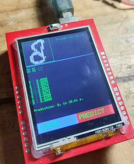

# Two layer fully connected network on ATmega328 (Arduino Uno R3)
## Preface

- **Author:**  
	- Auralius Manurung (auralius.manurung@ieee.org)  
- **Repositories:** 
	- [Download the whole project files here (Visual Code and PlatformIO)](https://drive.google.com/file/d/156KA2AQ_NmlQ6s9Vb0hkxTVZj1cXPOjE/view?usp=sharing).
	- [Google Colab notebook](https://colab.research.google.com/drive/1UFKH2KD140519j4UWmnDx9_BQ5deOaGe?usp=sharing)    
	- [Dataset link](https://drive.google.com/file/d/1hflXVZbdAvp15LP2oytCWPqDjGo90O4y/view?usp=drive_link)
- **Video demonstration :** (speed x 2) 


# Plan
This project demonstrates how an SD card can be used to implement a two-layer Fully Connected Network (FCN) for digit recognition on an Arduino Uno R3.  

The Arduino Uno R3 has extremely limited RAM and flash memory. In practical applications, especially those involving a graphical user interface, the interface alone can consume a large portion of the available resources. This makes it impractical to store intermediate activations, layer outputs, or large parameter arrays directly in memory.  

To address this limitation, our plan is to rely on external storage in the form of an SD card. We will use the SD card to stream data that would otherwise exceed the memory capacity of the microcontroller, enabling the execution of a simple neural network pipeline under tight embedded constraints at the cost of the inference time.
## Hardware
- Arduino Uno R3
- 2.4 in TFT touch display (UNO shield) from MCUFRIEND
- SD Card



## Training
The network is designed and trained in Google Colab using the USPS dataset. The USPS dataset is selected over MNIST to minimize memory requirements. Because inference is executed directly on the ATmega328 microcontroller, strict memory constraints are encountered as early as the preprocessing stage. This is due to the device’s 2 KB RAM capacity.


The following Python code shows the Keras implementation. Here, we set 64 neurons ($n=64$) in the hidden layer.
```python
model = Sequential([
    Dense(64, input_shape=(256,), activation='relu', kernel_initializer=initializer),  
    Dropout(0.3),  # <-- training only
    Dense(10, activation='softmax', kernel_initializer=initializer)  #
], name='two-layer-fcn')
```

After training, we can run the exporter and will receive the following files. These file will be copied to the SD Card.
```
/content/drive/MyDrive/NOODLE/datasets/usps/fcn2/w01.txt
/content/drive/MyDrive/NOODLE/datasets/usps/fcn2/w01.h
/content/drive/MyDrive/NOODLE/datasets/usps/fcn2/b01.txt
/content/drive/MyDrive/NOODLE/datasets/usps/fcn2/b01.h
/content/drive/MyDrive/NOODLE/datasets/usps/fcn2/w02.txt
/content/drive/MyDrive/NOODLE/datasets/usps/fcn2/w02.h
/content/drive/MyDrive/NOODLE/datasets/usps/fcn2/b02.txt
/content/drive/MyDrive/NOODLE/datasets/usps/fcn2/b02.h
```

|              Layer | Input | Output | Weight files | Bias files | Location |
| -----------------: | ----: | -----: | ------------ | ---------- | -------- |
| Fully connected #1 |   256 |     64 | `w01.txt`    | `b01.txt`  | SD Card  |
| Fully connected #2 |    64 |     10 | `w02.txt`    | `b02.txt`  | SD Card  |

## On the Uno side
```cpp
FCNFile FCN1;
FCN1.weight_fn = "w01.txt";
FCN1.bias_fn = "b01.txt";
FCN1.act = ACT_RELU;
// 256 input neurons, 64 hidden neurons
uint16_t V = noodle_fcn(GRID, 256, 64, OUTPUT_BUFFER1, FCN1, progress_hnd);

FCNFile FCN2;
FCN2.weight_fn = "w02.txt";
FCN2.bias_fn = "b02.txt";
FCN2.act = ACT_SOFTMAX;
// 10 output neurons
V = noodle_fcn(OUTPUT_BUFFER1, V, 10, OUTPUT_BUFFER2, FCN2, progress_hnd);
```

The inference completes in  about 10 to 11 seconds. This timing is very consistent since variability only comes from data transfer from SD Card to the micrcontroller.